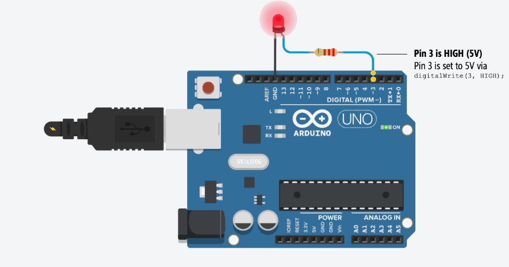

# IoT Smart Light System 💡

An IoT-based smart lighting system using NodeMCU and Blynk app. The light can be turned ON/OFF remotely through the mobile app over Wi-Fi.

## 🧰 Components
- NodeMCU (ESP8266)
- 1x LED
- 220Ω resistor
- Jumper wires
- Breadboard
- Smartphone with Blynk app
- Wi-Fi connection

## 📱 Blynk Setup
1. Install the **Blynk** app from Play Store/App Store
2. Create a new project and choose **ESP8266**
3. Add a **Button widget**
4. Set it to **Digital Pin D1**
5. Get the **Auth Token** from your email

## 🔌 Circuit Diagram


## 📄 Arduino Code
```cpp
#define BLYNK_PRINT Serial
#include <ESP8266WiFi.h>
#include <BlynkSimpleEsp8266.h>

char auth[] = "YourAuthToken";     // Replace with your actual Blynk Auth Token
char ssid[] = "YourWiFiSSID";      // Replace with your Wi-Fi name
char pass[] = "YourWiFiPassword";  // Replace with your Wi-Fi password

void setup()
{
  Serial.begin(9600);
  Blynk.begin(auth, ssid, pass);
  pinMode(D1, OUTPUT);
}

void loop()
{
  Blynk.run();
}

